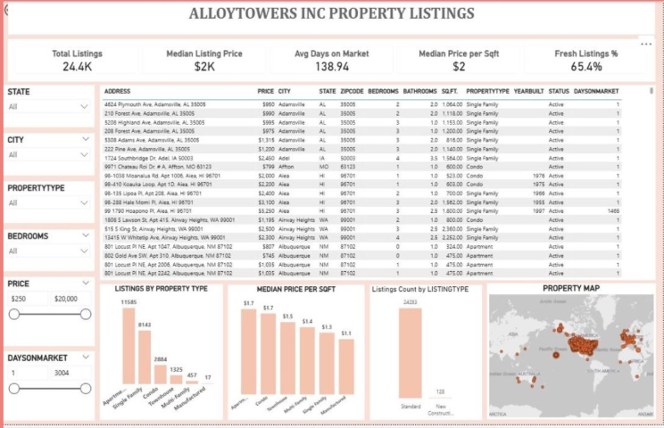
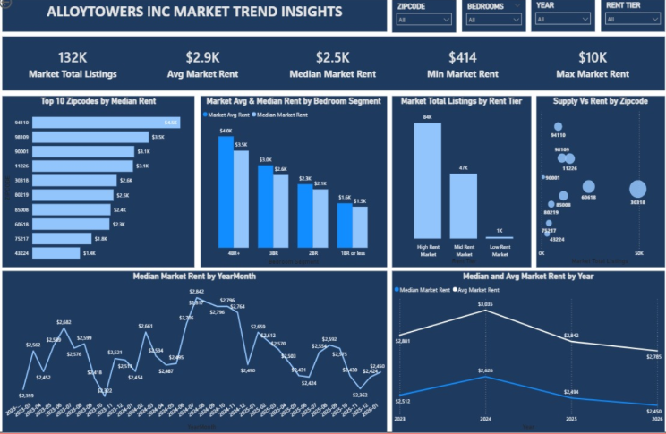

# 🏢 AlloyTower Inc. | Real Estate Analytics

### 📊 Business Analysis • Data Analytics • Dashboard Development

A collaborative project focused on designing a centralized data platform concept for a real estate company. The project aimed to bring property listings, customer inquiries, and market data together to improve reporting, streamline workflows, and support better business decisions.

---

## 📸 Project Dashboard

### 📈 Dashboard Overview

### 📊 Additional Dashboard View

---

## 🎯 Project Objectives

- 🗂️ **Centralize information:** Bring property listings, customer inquiries, and market data into one proposed platform.
- ⚡ **Improve efficiency:** Address fragmented information and manual workflows.
- 📊 **Support decision-making:** Use dashboards to make business information easier to understand.
- 🔍 **Improve visibility:** Help stakeholders access relevant information and insights.

---

## 👩‍💻 My Contribution

My contribution to this collaborative project focused on **data analytics and dashboard development**.

- 📉 Worked on data analysis to support business reporting.
- 📊 Contributed to dashboard design and data visualization.
- 💡 Helped present information in a format that supports business insights.
- 🤝 Collaborated with the project team on the proposed centralized data platform.

---

## 🛠️ Tools & Collaboration

- 📊 Data analytics and dashboard visualization
- 📑 Google Sheets
- 📋 Asana, Jira, and Trello
- 💬 Slack and Confluence

---

## 💡 Business Value

The proposed centralized platform was designed to help AlloyTower organize property-related information, reduce fragmented workflows, and improve access to business insights.

---

## 📌 Key Takeaway

This project strengthened my experience in using data analytics and dashboards to address business challenges and support informed decision-making in the real estate sector.

**Focus Areas:** `Real Estate Analytics` · `Data Visualization` · `Business Analysis` · `Dashboard Development`
